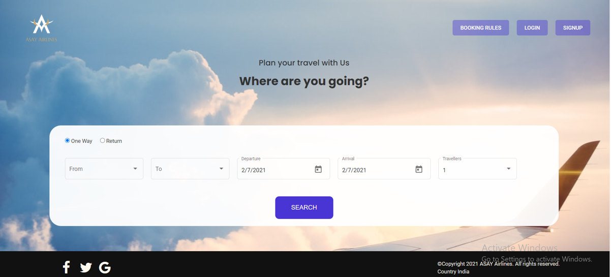
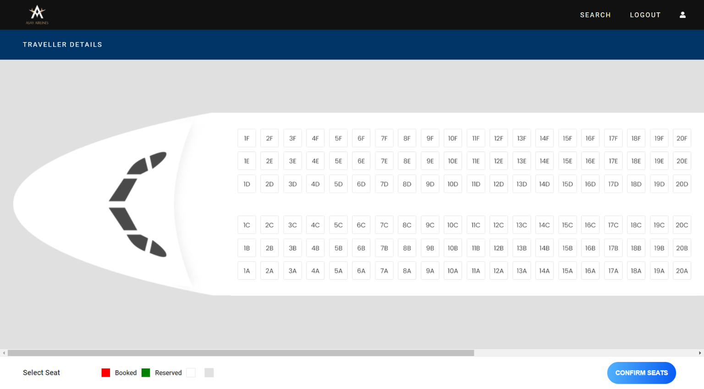
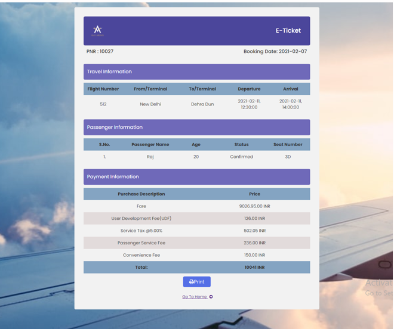

# Airline Booking Systen

This project was generated with [Angular CLI](https://github.com/angular/angular-cli) version 11.0.5.
An airline reservation system website created using MVC paradigm, frontend done in angular

### Home Page

### Seat Select page

### Ticket

### `Backend`

Check [backend](https://github.com/edsins/new_airline_api) here 

## Development server

Run `ng serve` for a dev server. Navigate to `http://localhost:4200/`. The app will automatically reload if you change any of the source files.

## Code scaffolding

Run `ng generate component component-name` to generate a new component. You can also use `ng generate directive|pipe|service|class|guard|interface|enum|module`.

